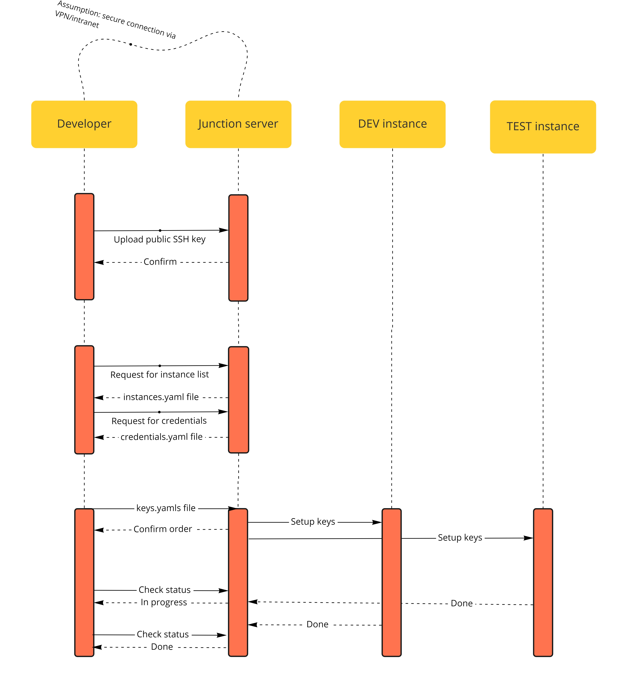

# High-level design

## System goal

The goal of the system is to provide a centralized management endpoint which will expose up-to-date user access data and will expire them automatically.
This will also allow the developers to quickly set up, test, validate and update connection to all the instances, and the sysadmin will have direct control over accesses to instances without the need to log onto each of them.

## Elements

The system should consist of several elements:
- the central security guard (for example, this could be Jenkins) which is accessible by DEVOPS/security and has access to all instances
- number of users (developers, QA, devops, release managers etc.) who want to have access to the instances
- target instances forming groups that form environments.

## Benefits

From the security perspective:
- less potential for information leak as the public key configuration is performed by the central unit (no need to grant password access to end users)
- automatic expiration of keys.
- no-password policy - only the RSA/ECDSA keys are allowed for connection and user cannot change this setting.

From the developer perspective:
- automatic script which will set up and test connectivity to all instances
- automatic script for key regeneration once expired
- automatic setup of /etc/hosts
- automatic upload of custom .bashrc files specified per instance-type where required.

From the sysadmin's perspective:
- A centralized, regularly updated view on access to all production instances which can be audited.
- Possiblity to add/extend/revoke access to certain instances at any time for any user.

## Sequence diagram

